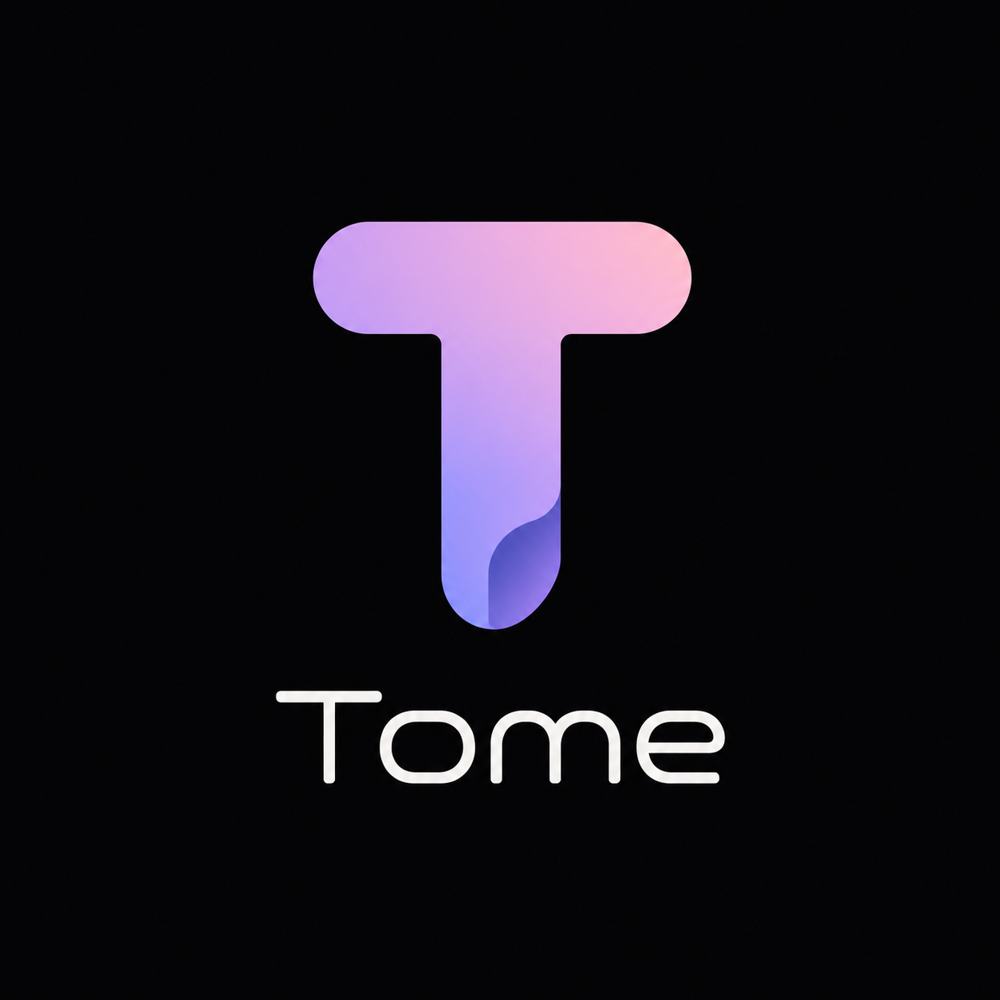

<p align="center">
  
</p>

<h1 align="center">Tome</h1>

<p align="center">
  A local-first presentation engine for Markdown — a browser for beautiful reading.
</p>

## Install

```bash
npm install -g tome-md
```

## Usage

```bash
tome README.md
tome docs/spec.md --mode pages
tome docs/spec.md --mode scroll
tome docs/spec.md --theme dark
tome docs/spec.md --theme light
```

## Local development

```bash
npm install
npm run build
node dist/cli/index.js sample.md
```

## What it does

- Renders Markdown in a polished local browser view.
- Supports page and scroll reading modes.
- Watches files and hot reloads changes.
- Includes light/dark Graphite-style themes.
- Keeps your original Markdown untouched.
